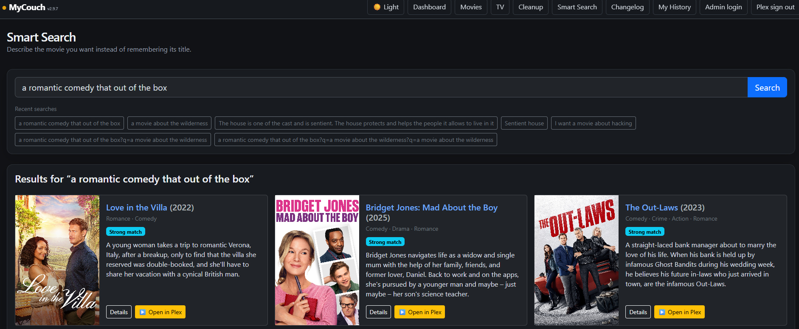
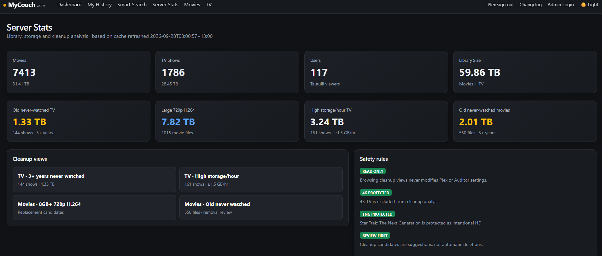
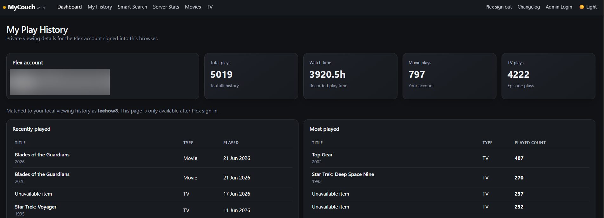

## Screenshots

### Dashboard

See what's new, what's recently been watched, and what's happening across your Plex library.

### Smart Search

Describe what you feel like watching in natural language and let MyCouch search your Plex library for matching titles.

### Server Stats

Explore Plex library size, storage usage, viewing activity and potential cleanup candidates.

### My History

Sign in with Plex to see your personal viewing history, watch time and most-played titles.

### Movies

Browse and analyse your movie library with viewing activity, file information and Radarr matching.

