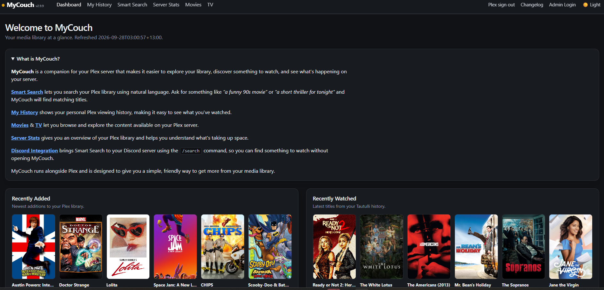
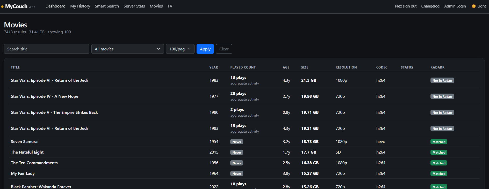

# 🛋️ MyCouch

**Current release: v2.9.17**

v2.9.17 focuses on Settings and page polish: Plex cache refresh progress is now stable after an update completes, key pages use centered mascot-led headers, and Movies/TV keep Export CSV at the far right of the library filter bar. It retains the people-aware Smart Search, Universal Media Preview and private-access model introduced across recent releases.

**Your media. Your history. What's next?**

MyCouch is a self-hosted companion for exploring and understanding a Plex media library. It combines library analysis, viewing activity, discovery/search, personal play history, cleanup review, Radarr/Sonarr matching, Tautulli activity and optional Discord integration.

> MyCouch is an independent project and is not affiliated with Plex, Tautulli, Radarr, Sonarr, Discord, Emby or Jellyfin.

## Current release — v2.9.17

### v2.9.17 — Settings & Page Polish

- Fixed repeated Settings page reloads after a completed Plex cache refresh.
- Stabilised the Plex update progress and status display.
- Reworked key pages with centered MyCouch mascot-led headers, page titles and short descriptions.
- Kept the Dashboard design unchanged and the Changelog mascot-free.
- Moved **Export CSV** to the far right of the Movies and TV filter/control bar.
- Refreshed static asset and PWA cache versions so updated styling is picked up reliably.
- Plex library cache updates remain configurable in Settings, including daily, every 12 hours and every 6 hours, with **Update Plex Now** available for an immediate refresh.

**Upgrade note:** no database migration is required. Existing runtime databases and `.pla-secret` remain compatible. A manual **Update Plex Now** is useful if Plex library artwork, links or metadata appear stale.

### v2.9.16 — Universal Media Preview

- Replaces the small popularity tooltip with a much larger rich movie/TV preview card.
- Works automatically on recognised movie/show links across Dashboard, Now Playing, Recently Added, Recently Watched, Movies, TV, Smart Search, My History, Review Queue and Leaving Soon.
- Movie previews can show poster, year, content rating, Plex rating, runtime, genres, director, cast, synopsis and aggregate Tautulli activity.
- TV previews can additionally show seasons, episode count and watched progress.
- Preview metadata is fetched only when needed and cached in the browser for instant repeat hovers.
- Desktop uses a short hover delay; touch devices use tap-to-preview with a second tap continuing to the title.
- Preview positioning automatically stays within the browser window and supports dark/light mode.

**Upgrade note:** run **Update Plex Now** once after upgrading to populate the richer TV preview metadata and rating fields added in v2.9.16. Existing caches still work with a reduced preview until refreshed.

### v2.9.15.2 — Smart Search intent fix

- Multi-person searches such as `Ben Affleck and Matt Damon together` require both people in the same title.
- Person-plus-role searches such as `Robin Williams in a serious role` combine the person match with dramatic genre intent.

### v2.9.15.1 — People ranking fix

- Full actor/director name matches receive a stronger ranking boost.
- **People match** is only shown for genuine cached Plex people metadata matches.

### v2.9.15 — Smart Search, Discord & UI Polish

- Smart Search now indexes Plex actor and director tags during a Library Refresh.
- Searches such as `something with Tom Hanks` or `a Spielberg movie` can match people as well as titles, genres and summaries.
- Movie detail and Smart Search cards show director/cast information when available.
- Runtime is displayed naturally as `1h 42m` rather than only a minute count.
- Discord `/search` continues to use the exact same Smart Search engine, so people-aware results work there too after the cache is refreshed.
- Improved responsive Smart Search cards and light-mode styling.
- Preserves the v2.9.14 private-access/security model and v2.9.14.3 stale ratingKey relinking fixes.

**Upgrade note:** after replacing the application files, run **Update Plex Now** once in Settings to populate the new actor/director cache fields. Existing runtime databases and `.pla-secret` remain compatible.

### v2.9.14.3 — Stale Plex ratingKey fix

- Validates historical Tautulli ratingKeys against the live Plex server instead of assuming every ID still present in `auditor-cache.db` is current.
- When Plex returns 404 for a cached historical ID, MyCouch now continues through the title/year relinker and stores the replacement current Plex ratingKey.
- Filters stale title/year candidates when more than one cached Plex record exists for the same title.
- Poster requests using an old historical ratingKey can retry through the saved Tautulli identity before showing the fallback poster.
- Keeps the v2.9.14 security model unchanged.

### v2.9.14.2 — Historical poster relinking fix

- Fixed historical Tautulli items whose old Plex ratingKeys now return 404.
- Relinking now tolerates punctuation and spacing differences between Tautulli titles and the current Plex cache.
- Successful old-to-current ratingKey matches are saved for future dashboard loads.
- Popular Movies/TV and Recently Watched now share the same relinking resolver for poster and detail links.
- Genuine missing artwork still uses the clean Poster unavailable fallback.

### v2.9.14.1 — Poster reliability fixes

### Security & Private Access

v2.9.14 makes MyCouch private by default when exposed through a public hostname.

- Plex login is required before library, history, search, Server Stats, poster, and activity data can be viewed.
- A valid Plex account is not enough: MyCouch verifies that the signed-in account can access the configured Plex server.
- Anonymous visitors see only the private landing/sign-in experience.
- Library and data/API routes enforce authorization on the server, rather than relying on hidden navigation.
- Plex access tokens are used only during sign-in verification and are not stored in the browser session.
- Added private/no-store response handling and security headers for authenticated/admin pages.
- Added `noindex` response metadata and a restrictive `robots.txt` to discourage indexing by well-behaved crawlers.
- Added lightweight Security Activity logging for noteworthy events such as denied access, failed authorization, CSRF rejection and suspicious probe paths.
- Security Activity is automatically pruned after 30 days and does not record tokens, cookies or query strings.
- Preserved the case-sensitive Dashboard and Movies screenshot asset names (`Dashboard.png` and `Movies.png`).

### v2.9.13 — Server Stats Gets a Makeover

v2.9.13 gives Server Stats and the Movie/TV detail pages a more visual, useful interface while improving how MyCouch handles long-term Tautulli history.

- Redesigned **Popular Movies** and **Popular TV** as compact Top 10 poster grids.
- Added ranking badges and hover details for viewers, plays, and viewing hours.
- Redesigned Movie detail pages with artwork, metadata, activity, storage, video information, Plex links, and Radarr status.
- Redesigned TV detail pages with artwork, season/episode information, activity, storage, quality information, Plex links, and Sonarr status.
- Popular titles link directly to their detail pages.
- Historical title and year information from Tautulli is now retained locally during sync.
- If Plex recreates an item with a new rating key, MyCouch can match the historical title/year to the current library item.
- Relinked titles use the current Plex poster and working detail page while retaining their historical viewing statistics.
- Items genuinely no longer in Plex remain represented in historical statistics instead of exposing obsolete Plex IDs.
- Dashboard rendering remains local-only; historical recovery no longer requires a live Tautulli request during page load.

### v2.9.12 — Smarter Smart Search

v2.9.12 focuses on making Smart Search behave like a natural-language search of your Plex library rather than a loose keyword search.

- Added strict year and decade constraints, including searches such as `from 1994`, `from the 90s`, and `from the 1980s`.
- Added genre-aware search intent for common genres and phrases such as `funny`, `sci-fi`, `horror`, and `romantic`.
- Added watched and unwatched constraints tied to Plex viewing data.
- Added runtime parsing for searches such as `under 90 minutes`, `less than 2 hours`, `over 2 hours`, and `around 90 minutes`.
- Added **Smart Search understood** so you can see how MyCouch interpreted a natural-language query.
- Search results now enforce requested constraints instead of filling the page with increasingly weak matches.
- Improved result ranking so equally relevant titles are no longer automatically ordered newest-first.
- Improved match labels so **Strong match**, **Good match**, and **Possible match** reflect the actual query.
- Added an explicit **Show closest matches** fallback when no exact result exists.
- Closest matches relax constraints in a predictable order: runtime first, then watched status, then year. Core genre intent remains strict.
- Recent searches are now stored per signed-in Plex user; signed-out visitors use the shared search history.
- Added a **Clear history** control for the current user's search history.
- Updated the sidebar version display to use the application version instead of a hard-coded release number.

### v2.9.11 — Installable MyCouch app and interface redesign

- Added Progressive Web App (PWA) support.
- MyCouch can be installed from supported desktop and mobile browsers and launched in its own standalone app window.
- Added application icons, web app manifest, and a lightweight service worker for static assets.
- Added an **Install MyCouch** option when installation is available.
- Redesigned navigation around a responsive left-hand sidebar.
- Moved Plex, Changelog, Admin, and display controls into the sidebar.
- Redesigned the Dashboard with a new **Welcome to MyCouch** hero and visual shortcuts.
- Added Recently Added and Recently Watched panels while retaining live What's Playing and activity information.
- Added MyCouch couch artwork throughout the interface.
- The PWA does not cache Plex history, Tautulli activity, authenticated pages, or other dynamic/private data.

## Screenshots

These prepared screenshots show the v2.9.9 layout before the couch artwork was added in v2.9.10. The Plex account panel in My History is obscured.

### Dashboard

### My History

### Server Stats

### Movies

## Fresh install on Windows

1. Install Python 3.
2. Extract MyCouch to a folder of your choice.
3. Run `start.ps1`.
4. Open `http://localhost:8090`.
5. Create the first admin account.
6. In **Settings**, select your Plex SQLite database and build the library cache.
7. Configure Tautulli, Radarr, Sonarr, Plex and Discord only if you want those integrations.

`start.ps1` creates a local `.venv` and installs the packages in `requirements.txt`.

You can optionally set `PLEX_DB` before launch instead of selecting the database in Settings. See `.env.example` for an example; MyCouch does not automatically load `.env` files.

## Upgrade from LibraryLens

Stop LibraryLens first and make a backup of its folder.

Copy these existing runtime files into the new MyCouch folder:

- `auditor.db`
- `auditor-cache.db`
- `.pla-secret`

Keeping `.pla-secret` preserves existing remembered admin sessions. The legacy filenames are intentionally retained for compatibility.

Then run `start.ps1`. Your settings, protected titles, review queue, Tautulli cache, Arr matches, Discord settings and other local state remain in the existing databases.

## Security / privacy

Do **not** commit or publish your runtime databases or secret file. The supplied `.gitignore` excludes:

- `auditor.db` and SQLite sidecars
- `auditor-cache.db` and SQLite sidecars
- `.pla-secret`
- Plex snapshot files
- backups/logs
- `.env` files
- Python virtual environments and caches

API keys, Plex server tokens, Discord bot tokens/webhooks and private viewing identities are stored locally. Public pages expose aggregate activity rather than viewer identities.

Do not port-forward the Flask development server on port 8090 directly to the Internet. Use an HTTPS reverse proxy or secure tunnel if remote access is required.

## Plex sign-in

MyCouch uses Plex's browser/PIN authorization flow and never asks for a Plex password. The user sign-in token used to identify the account is not persisted as the user's login credential. Server-side Plex integration credentials configured by an administrator remain local.

## Discord

Outgoing webhooks can publish aggregate statistics, recommendations and Leaving Soon notices. The optional bot adds `/search`, returning MyCouch movie matches with posters and Open in Plex links. Bot tokens and webhook URLs must be entered locally and should never be committed to Git.

## GitHub

The intended project home is the **MyCouchApp** organisation with the **MyCouch** repository.

Before any public push, verify the staged files with `git status` and confirm that no databases, tokens, webhooks, backups, logs or personal media paths are included.

The artwork sheet is `static/mycouch-artwork.jpg`; the square GitHub avatar is `static/mycouch-github.png`.
